# RustShop - Full-Stack E-Commerce Platform

A complete e-commerce platform built entirely in Rust, featuring a high-performance Axum backend and a WebAssembly frontend powered by Yew.

## Tech Stack

| Layer | Technology |
|-------|------------|
| Backend | Rust, Axum, SQLite, SQLx |
| Frontend | Rust, Yew, WASM, Trunk |
| Auth | JWT, Argon2 |
| Shared | Common types between backend & frontend |

## Features

- **User Authentication**: Register, login, logout with JWT tokens
- **Product Catalog**: Browse products with categories and search
- **Shopping Cart**: Add, update quantity, remove items
- **Order Management**: Create orders, view order history
- **Responsive UI**: Clean, modern interface

## Project Structure

```
rust-ecommerce/
├── backend/          # Axum REST API server
│   └── src/
│       ├── auth/     # JWT & password handling
│       ├── db/       # SQLite repositories
│       └── routes/   # API endpoints
├── frontend/         # Yew WASM application
│   └── src/
│       ├── api/      # HTTP client
│       ├── components/
│       ├── pages/
│       └── state/    # Auth & cart state
├── shared/           # Common types
│   └── src/
│       ├── api/      # Request/Response types
│       └── models/   # Data models
└── 验收/             # Acceptance test screenshots
```

## Quick Start

### Prerequisites

- Rust (latest stable)
- Trunk (`cargo install trunk`)
- wasm32 target (`rustup target add wasm32-unknown-unknown`)

### Run Backend

```bash
# Start the API server (port 3000)
cargo run -p backend

# Load seed data (12 sample products)
cargo run -p backend --bin seed
```

### Run Frontend

```bash
cd frontend
trunk serve  # Starts on port 8080
```

### Access

- **Frontend**: http://localhost:8080
- **Backend API**: http://localhost:3000
- **Health Check**: http://localhost:3000/health

## API Endpoints

| Endpoint | Method | Description |
|----------|--------|-------------|
| `/health` | GET | Health check |
| `/api/auth/register` | POST | User registration |
| `/api/auth/login` | POST | User login |
| `/api/products` | GET | Product list |
| `/api/products/:id` | GET | Product detail |
| `/api/categories` | GET | Category list |
| `/api/cart` | GET/POST | Cart operations |
| `/api/cart/:id` | PUT/DELETE | Update/remove cart item |
| `/api/orders` | GET/POST | Order operations |
| `/api/orders/:id` | GET | Order detail |

## Screenshots

### Home Page
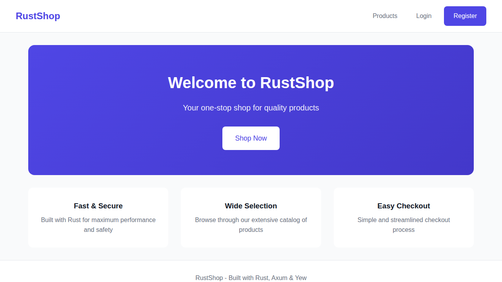

### Product Catalog
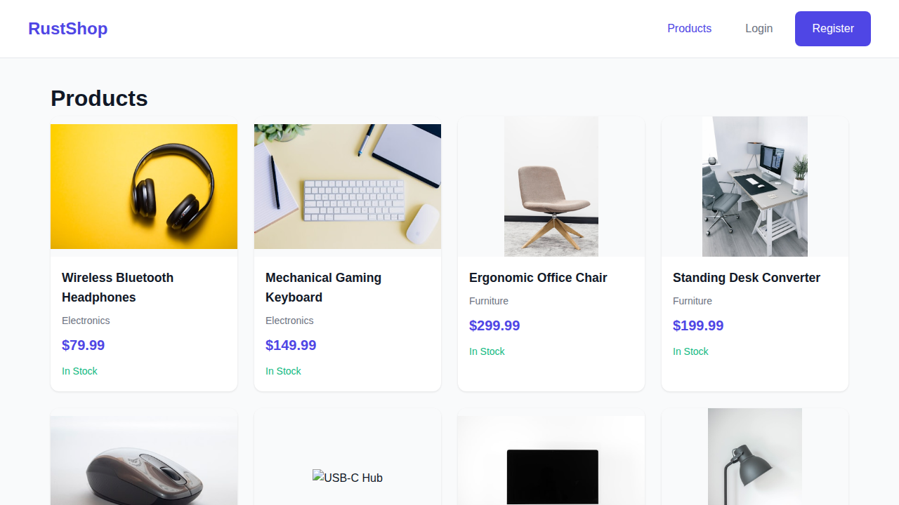

### Product Detail


### User Authentication

| Login | Register |
|-------|----------|
| 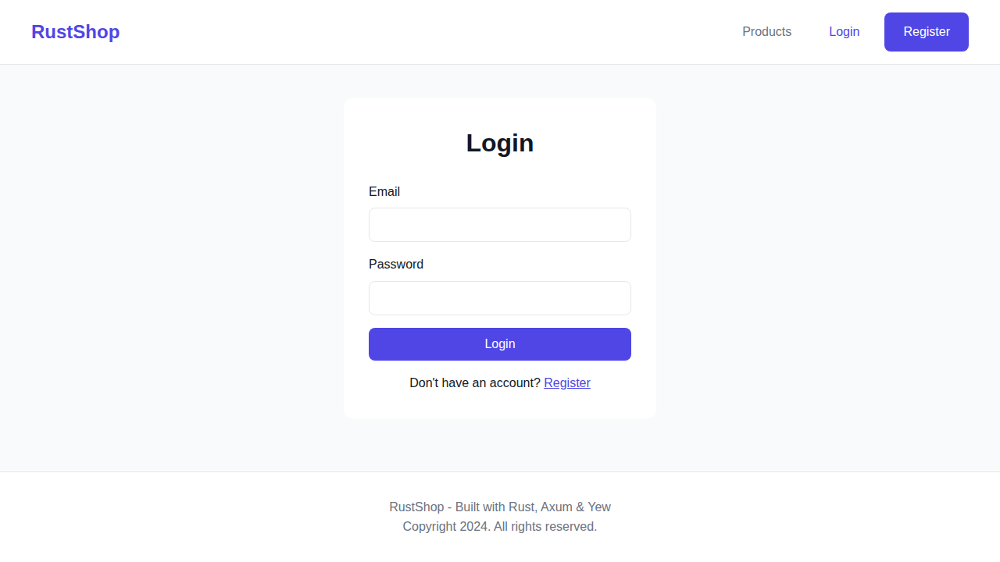 | 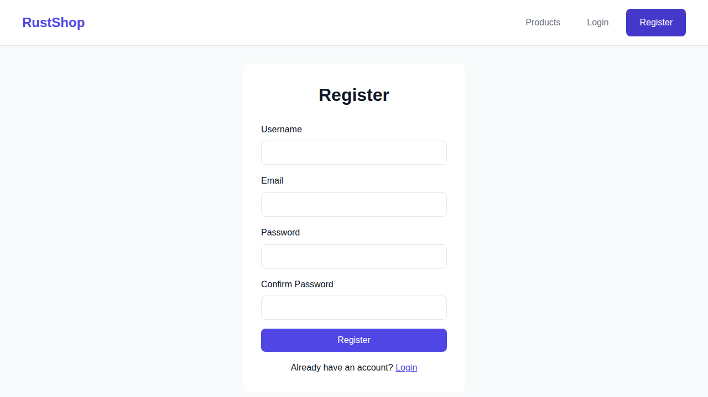 |

### Registration Flow

| Fill Form | Error Handling | Success |
|-----------|----------------|---------|
| 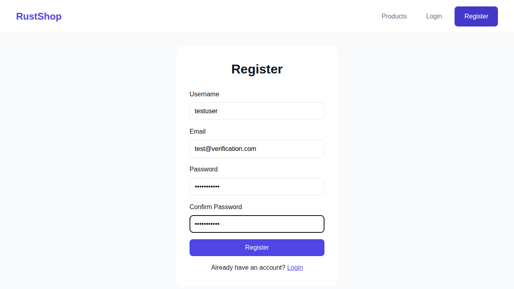 | 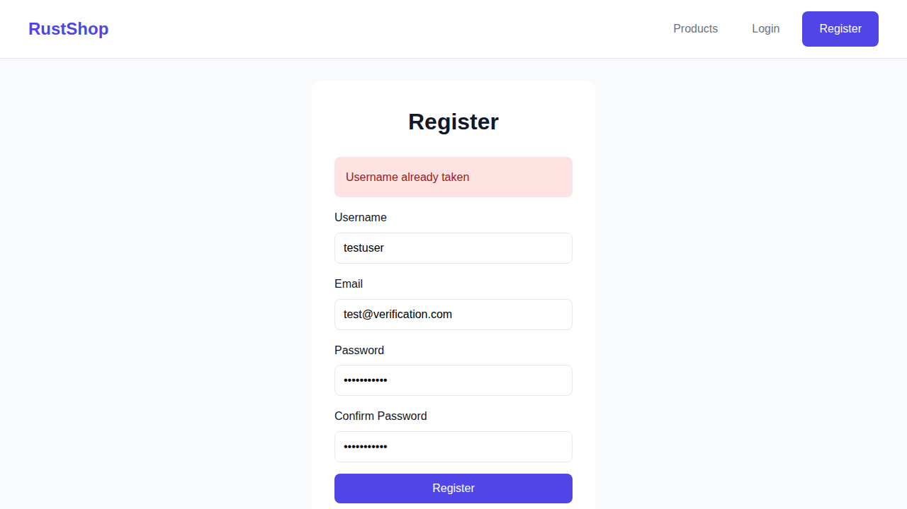 | 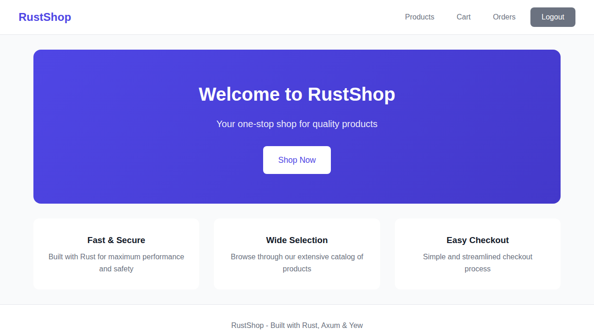 |

### Shopping Flow

| Product (Logged In) | Add to Cart |
|---------------------|-------------|
| 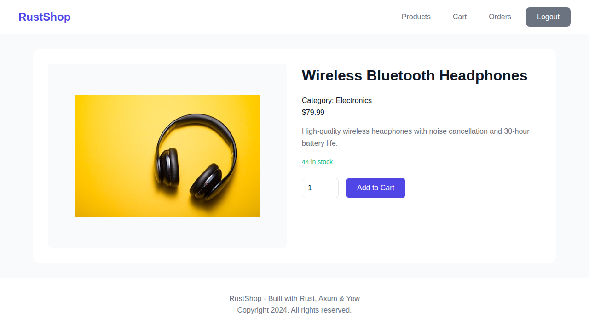 | 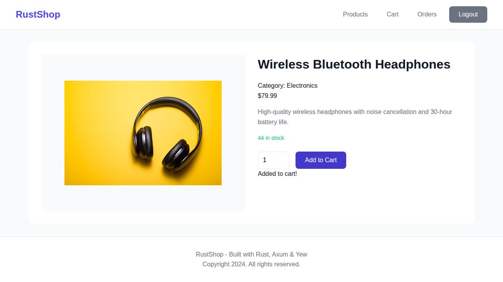 |

### Cart Management

| Cart View | Update Quantity |
|-----------|-----------------|
| 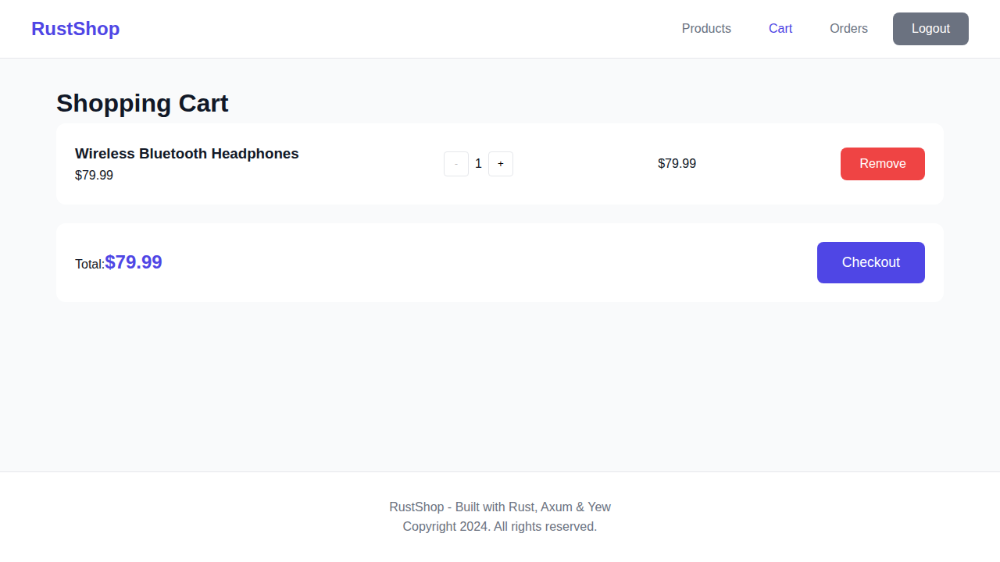 |  |

### Order Management

| Order Created | Order List | Logout |
|---------------|------------|--------|
| 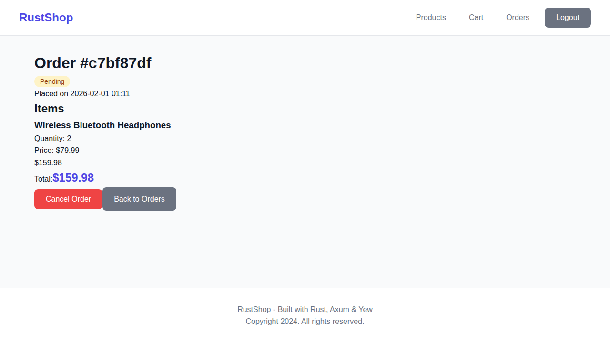 | 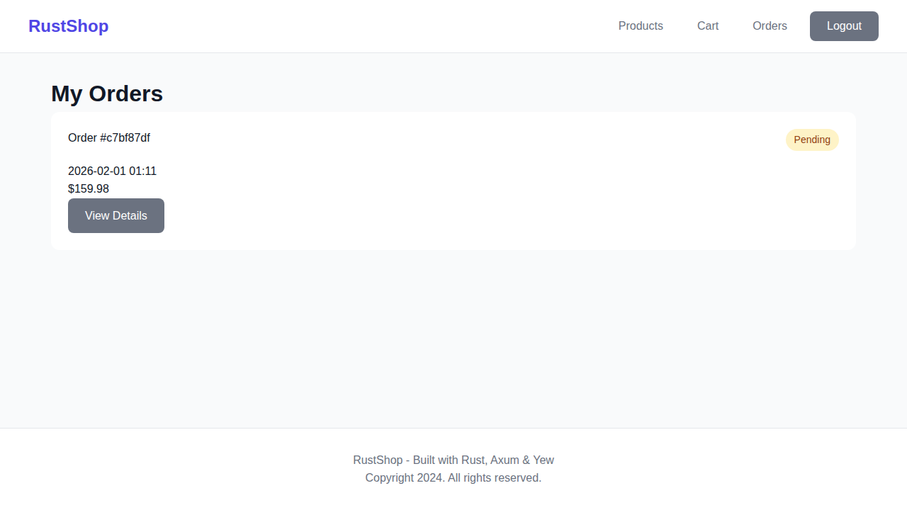 | 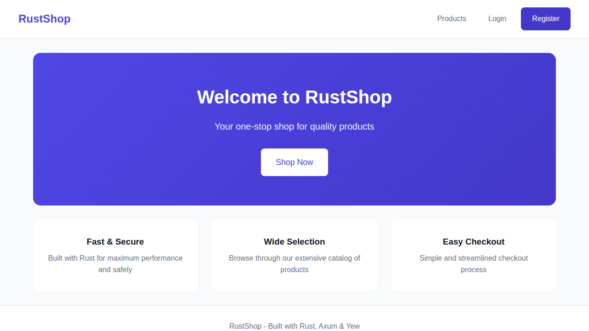 |

## Test Results

| Category | Tests | Status |
|----------|-------|--------|
| Authentication | 5 | ✅ Pass |
| Products API | 4 | ✅ Pass |
| Cart API | 4 | ✅ Pass |
| Orders API | 3 | ✅ Pass |
| Server | 2 | ✅ Pass |
| Frontend Pages | 14 | ✅ Pass |
| **Total** | **32** | **✅ All Pass** |

## License

MIT

---

*Built with Rust, Axum & Yew*
